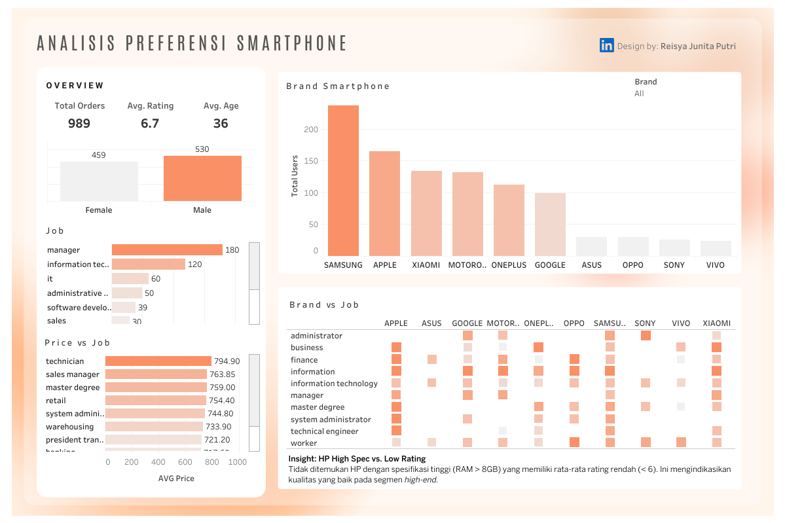

# 📊 **Data Analyst Portfolio**
### 🎯 *Mengubah Data Menjadi Insight yang Bermakna*  

---

## 👋 Tentang Portfolio Ini
Selamat datang di **Data Analyst Portfolio** saya!  
Repo ini berisi kumpulan proyek analisis data yang saya kerjakan secara end-to-end menggunakan **SQL, Python, dan Tableau**.  
Setiap proyek dirancang untuk menunjukkan kemampuan dalam:
- 📈 *Data Cleaning & Exploration*  
- 🔍 *Insight Extraction & Business Understanding*  
- 🎨 *Data Visualization & Storytelling*

> ✨ Fokus saya adalah bagaimana data bisa menjawab pertanyaan bisnis dan membantu pengambilan keputusan yang lebih baik.

---

## 🧩 Daftar Proyek  

| No | Proyek | Tools | Deskripsi Singkat | Insight Utama |
|----|--------|--------|------------------|----------------|
| 1 | [📱 Smartphone Preference Analysis](https://github.com/reisyajunita/cellphones_smartphone_analysis) | SQL + Tableau | Analisis preferensi merek smartphone berdasarkan latar belakang pekerjaan dan rating pengguna. | Merek premium (Apple & Samsung) paling disukai oleh segmen profesional di bidang teknologi. |
| 2 | [🚗 Uber Ride Analytics](https://github.com/reisyajunita/uber_analysis) | SQL + Python + Tableau | Eksplorasi pola perjalanan dan performa driver Uber berdasarkan waktu dan lokasi. | Aktivitas tertinggi terjadi di jam sibuk dan daerah bisnis utama. |
| 3 | [🎓 Student Dropout Prediction](https://github.com/reisyajunita/LaskarAI-Final-Portfolio/tree/main/08-Penerapan-DS-2) | Python + XGBoost + Streamlit | Model machine learning untuk memprediksi risiko dropout mahasiswa. | Faktor utama dropout: performa akademik & tingkat absensi. |
| 4 | 🚧 *Next Project in Progress...* | — | Sedang mengerjakan proyek analisis data baru untuk memperluas portofolio dan kapabilitas storytelling. | — |

---

## 🧠 Keahlian yang Ditunjukkan
| Area | Tools | Keterangan |
|-------|--------|-------------|
| **Data Cleaning & Transformation** | SQL (MySQL), Pandas | Menghapus duplikasi, menangani missing value, dan transformasi tipe data |
| **Exploratory Data Analysis (EDA)** | SQL, Python | Mengidentifikasi pola dan outlier dengan pendekatan kuantitatif |
| **Data Visualization** | Tableau, Matplotlib | Membangun visualisasi interaktif dan laporan bisnis |
| **Machine Learning (Dasar)** | XGBoost, Scikit-learn | Model prediksi untuk klasifikasi & regresi sederhana |
| **Storytelling & Reporting** | Tableau, Markdown | Menyampaikan insight bisnis dalam format naratif dan visual |

---

## 📈 Contoh Dashboard
Berikut beberapa visualisasi interaktif dari proyek saya:

  
  
<i>Dashboard: Analisis Preferensi Smartphone Berdasarkan Profesi</i>

  
  
<i>Dashboard: Pola Perjalanan dan Aktivitas Pengemudi Uber</i>

> 🔗 Lihat semua dashboard di: [Tableau Public – Reisya Junita](https://public.tableau.com/app/profile/reisya.junita)

---

## 💻 Struktur Repositori
📁 data_analyst_portfolio  
│  
├── 📁 cellphones_analysis  
│   └── README.md  
├── 📁 uber_analysis  
│   └── README.md  
├── 📁 student_dropout_prediction  
│   └── README.md  
├── 📁 assets/  
│   └── dashboard_previews (gambar thumbnail dashboard)  
└── README.md  

---

## 🧩 Tentang Saya
👋 Halo! Saya **Reisya Junita Putri**, seorang **Data Analyst** dengan latar belakang Matematika.  
Saya senang mengubah data menjadi insight yang dapat menceritakan sesuatu yang bermakna — baik untuk bisnis maupun masyarakat.  

📍 *Minat utama:* SQL, Python, Tableau, dan Data Storytelling  
🎯 *Tujuan jangka panjang:* menjadi Data Scientist yang berfokus pada pemodelan dan visualisasi berbasis insight  

---

## 🤝 Hubungi Saya
✨ Mari terhubung dan berdiskusi mengenai peluang kerja, kolaborasi, atau proyek data!  

  
  
  
  

---

> 🌸 *"Turning Data into Insightful Stories"*  
> — Reisya Junita Putri  

