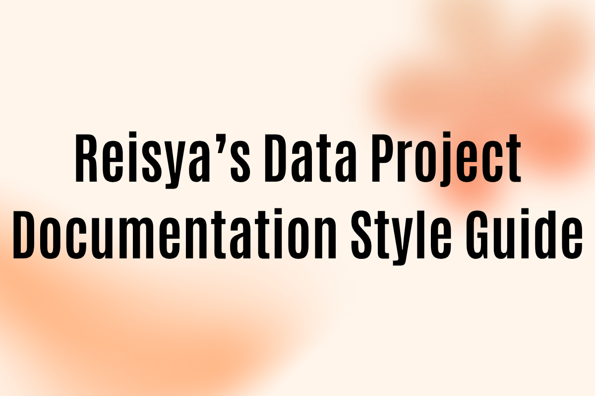

# 🌸 **Reisya’s Data Project Documentation Style Guide**
> *“Analisis data bukan hanya tentang angka, tapi tentang menceritakan sesuatu yang bermakna.”*  
> — Reisya Junita Putri  

---

## 🎯 **Tujuan Style Guide**
Panduan ini membantu menjaga konsistensi dan profesionalisme dalam setiap README proyek data analisismu — supaya mudah dibaca, menarik, dan punya ciri khas pribadi.

### Tujuan Utama:
- Menyusun README yang **terstruktur dan mudah dipahami.**
- Menunjukkan **personal branding** kamu sebagai Data Analyst yang komunikatif.
- Menciptakan dokumentasi proyek yang **ramah bagi HR, Data Lead, maupun non-teknis.**

---

## 🧩 **Struktur Wajib README**
Gunakan urutan ini untuk setiap proyek:

| Urutan | Bagian | Fungsi |
|--------|---------|--------|
| 1 | **Judul + Subjudul** | Menjelaskan tema proyek dan tujuannya |
| 2 | **Pendahuluan** | Latar belakang bisnis dan konteks masalah |
| 3 | **Dataset** | Sumber data dan deskripsi singkat |
| 4 | **Pertanyaan Bisnis** | 3–5 pertanyaan utama beserta tujuan analisis |
| 5 | **Alur Analisis (Workflow)** | Langkah analisis dari import, EDA, cleaning, hingga visualisasi |
| 6 | **Temuan Utama (Key Findings)** | Insight penting dalam bentuk poin atau tabel |
| 7 | **Rekomendasi Bisnis** | Tabel fokus dan strategi hasil analisis |
| 8 | **Dashboard / Visualisasi** | Link ke Tableau atau screenshot visual utama |
| 9 | **Tools & Teknologi** | Tabel daftar tools dan fungsinya |
| 10 | **Struktur Folder Proyek** | Menjelaskan isi repo |
| 11 | **Kesimpulan & Refleksi** | Insight utama dan pembelajaran pribadi |
| 12 | **Credits / Tentang Saya** | Nama, role, dan kontak LinkedIn |

---

## 🎨 **Gaya Penulisan**

### 💬 1. Tone
- Gunakan gaya **profesional tapi ramah**.  
- Hindari kalimat pasif berlebihan.  
- Tulis seolah kamu menjelaskan ke rekan kerja non-teknis.  

**Contoh:**
> “Analisis ini bertujuan untuk memahami pola pembelian pelanggan.”  
> bukan  
> “Penulis melakukan analisis untuk memahami pola pembelian.”

---

### ✨ 2. Storytelling Flow
Gunakan pola berikut saat menjelaskan insight:

Data → Fakta → Makna → Rekomendasi

**Contoh:**
> Data menunjukkan 70% pengguna Uber aktif di jam sibuk.  
> Fakta ini mengindikasikan adanya lonjakan permintaan sore hari.  
> Artinya, Uber dapat menambah armada pada jam 17.00–19.00.  
> Rekomendasi: optimasi jadwal driver pada periode tersebut.

---

### 📊 3. Visual & Format
- Gunakan emoji heading (📊, 🧩, 💡, ⚙️, dll.)  
- Gunakan **tabel markdown** untuk insight dan rekomendasi.  
- Gunakan *italic* untuk istilah asing, dan **bold** untuk istilah penting.  
- Maksimal 4 poin per daftar agar tetap ringan dibaca.  

---

### 🧠 4. Refleksi Pribadi (di Kesimpulan)
Tambahkan kalimat reflektif di akhir setiap proyek, misalnya:

> Proyek ini mengajarkan saya pentingnya memahami konteks bisnis sebelum melakukan analisis teknis.  
> Saya belajar bahwa data yang bersih adalah fondasi insight yang bermakna.

---

## 🧰 **Checklist Sebelum Publish**
✅ Struktur README lengkap sesuai 11 bagian  
✅ Minimal 1 visualisasi (dashboard / chart)  
✅ Semua link berfungsi  
✅ Grammar dan format markdown sudah dicek  
✅ Insight → jelas, to the point, dan berbasis data  

---

## 💻 **Ciri Khas Reisya’s Style**
| Elemen | Ciri Khas |
|---------|------------|
| 🎨 **Warna** | Soft beige / pastel tone |
| 💬 **Gaya tulis** | Tenang, percaya diri, dan human |
| 🧩 **Struktur** | Teratur, modular, dan mudah dipahami |
| ✨ **Fokus utama** | Clarity • Empathy • Storytelling |
| 📈 **Penutup khas** | Refleksi yang menunjukkan growth mindset |

---

## 🌷 **Kesimpulan**
Dengan mengikuti panduan ini, setiap proyekmu akan tampak:
- 💼 Profesional dan konsisten  
- 🌸 Punya karakter personal yang menonjol  
- 💬 Mudah dipahami oleh audiens non-teknis  
- 🧠 Siap tampil sebagai *portfolio signature style Reisya*  

> *Your data projects are not just analysis — they’re your personal story told through insights.*

---
