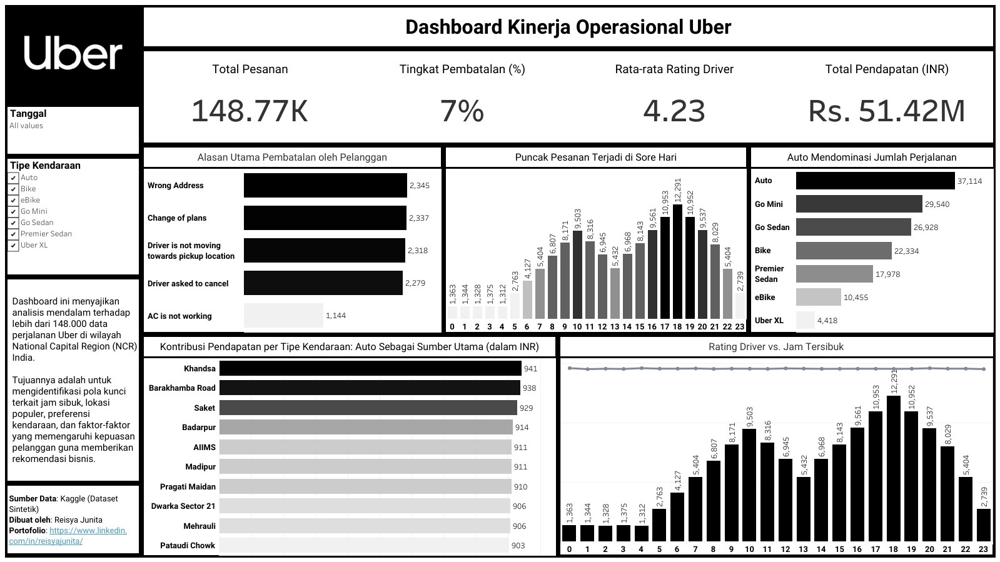

# 🚖 **Uber Ride Analytics**
### 📊 *Memahami Pola Perjalanan dan Perilaku Pengguna Uber*

---

## 🧭 **Gambaran Umum**
Proyek ini bertujuan untuk menganalisis **pola perjalanan dan perilaku pelanggan Uber** berdasarkan waktu, lokasi, dan aktivitas pengguna.  
Analisis dilakukan untuk menemukan kapan dan di mana permintaan tertinggi terjadi, serta bagaimana perilaku pengguna bervariasi sepanjang hari.

> 💡 *Tujuan utama: membantu perusahaan memahami tren permintaan agar dapat mengoptimalkan jadwal dan distribusi driver.*

---

## ⚙️ **Alur Singkat Analisis**
Proyek ini dikerjakan menggunakan kombinasi **SQL, Python, dan Tableau**:

| Tahap | Tools | Deskripsi |
|--------|--------|------------|
| 📥 Data Import | SQL (MySQL) | Memuat dan menyiapkan data perjalanan |
| 🔍 Exploratory Data Analysis | Python (Pandas, Matplotlib) | Mengeksplorasi pola waktu, lokasi, dan jarak |
| 🧹 Data Cleaning | SQL + Python | Menghapus duplikasi dan anomali data |
| 📈 Visualization | Tableau | Membuat dashboard interaktif untuk analisis waktu dan aktivitas |

---

## 💡 **Temuan Utama**
- 📆 Aktivitas tertinggi terjadi **pada jam 17.00–19.00**, terutama di hari kerja.  
- 🌇 **Wilayah bisnis utama** menunjukkan frekuensi perjalanan tertinggi.  
- 🚗 **Perjalanan jarak pendek (2–5 km)** mendominasi permintaan harian.  
- 💬 Pengguna cenderung melakukan **perjalanan berulang di jam yang sama setiap hari**, menunjukkan rutinitas tetap.

---

## 🧩 **Insight Bisnis & Rekomendasi**
| Fokus | Rekomendasi |
|--------|--------------|
| 🕐 Optimalisasi Jadwal Driver | Tambah armada di jam sibuk (17.00–19.00) di area bisnis utama. |
| 🗺️ Penentuan Zona Prioritas | Fokus promosi di area dengan perjalanan berulang tinggi. |
| 💸 Strategi Tarif Dinamis | Gunakan *dynamic pricing* saat puncak permintaan sore hari. |

---

## 📊 **Dashboard Visualisasi**
> 🔗 [Lihat Dashboard Interaktif di Tableau Public](https://public.tableau.com/views/uber_dashboard_17578564618230/Dashboard?:language=en-US&publish=yes&:sid=&:redirect=auth&:display_count=n&:origin=viz_share_link)

  
  
<i>Dashboard: Pola Aktivitas Pengguna dan Waktu Perjalanan</i>

---

## 🛠️ **Tools & Teknologi**
| Tools | Fungsi |
|--------|--------|
| 🗄️ MySQL | Analisis awal dan query data |
| 🐍 Python | EDA, data cleaning, dan eksplorasi pola |
| 📊 Tableau | Visualisasi interaktif dan laporan bisnis |
| 💻 VS Code | Pengelolaan file & dokumentasi proyek |

---

## 🔗 **Repo Asli & Dokumentasi Lengkap**
📁 [Lihat Proyek Lengkap di GitHub →](https://github.com/reisyajunita/uber_analysis)  
Berisi seluruh file SQL, notebook Python, insight lengkap, dan refleksi hasil analisis.

---

> 🌸 *“Data yang baik bukan hanya menjelaskan masa lalu, tapi membantu kita memahami apa yang harus dilakukan selanjutnya.”*  
> — Reisya Junita Putri  

